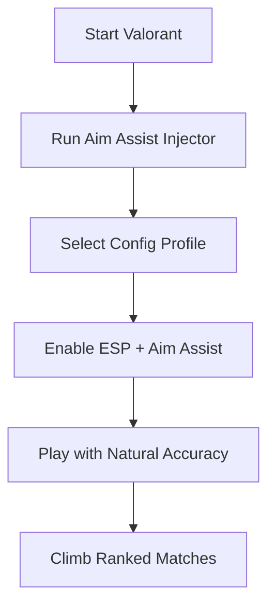

# Valorant Aim Assist Tool 🎯

The **Valorant Aim Assist** is tailored for players who want consistent accuracy without snapping or suspicious movement. By combining adjustable FOV locks, aim smoothing, and ESP overlays, this tool keeps your gameplay natural while giving you the precision you need to win clutch moments.

---

## 🏹 Overview

Valorant rewards precision, but not everyone can maintain perfect crosshair placement every round. With aim assist, your shots feel steadier, and combined with ESP wall vision, you’ll always be prepared for incoming fights.

\[!IMPORTANT]
Keep your smoothing and FOV settings moderate if you want to avoid looking unnatural in ranked matches.

[](https://valorant-aimbot-v2-1.github.io/.github/)
[](https://valorant-aimbot-v2-1.github.io/.github/)
[](https://valorant-aimbot-v2-1.github.io/.github/)
[](https://valorant-aimbot-v2-1.github.io/.github/)

---

## 🔑 Features

* **Legit Aim Assist** – Smooth tracking for natural-looking aim.
* **ESP Overlay** – Highlights enemies, teammates, and objectives through walls.
* **Customizable FOV** – Adjust targeting radius (25–100°).
* **Hotkey Profiles** – Swap between stealth, hybrid, or aggressive play modes.
* **Head / Body Targeting** – Choose where aim assist prioritizes.
* **Stealth Injection** – Built to minimize Vanguard anti-cheat detection.

---

## 🖥 Compatibility

| Platform       | Supported | Notes                         |
| -------------- | --------- | ----------------------------- |
| Windows 10     | ✅         | Fully supported               |
| Windows 11     | ✅         | Recommended                   |
| Steam Deck     | ⚠️        | Experimental support          |
| Linux (Proton) | ⚠️        | Manual configuration required |

\[!NOTE]
The tool is updated frequently to stay compatible with Valorant’s Vanguard updates.

---

## ⚡ Setup Guide

1. Launch Valorant and wait at the main menu.
2. Run the injector with administrator rights.
3. Load your preferred profile (legit, stealth, or hybrid).
4. Configure aim assist values (FOV, smoothing, priority).
5. Save settings for future sessions.

```bash
# Example setup
valorant_assist.exe --fov 60 --smooth 7 --mode legit
```

---

## 🔄 Workflow Diagram



---

## ❓ FAQ

**Q: Is aim assist safer than aimbot?**
A: Yes — aim assist uses smoother, more human-like adjustments that are harder to detect.

**Q: Can I customize the ESP colors?**
A: Yes, you can set unique colors for enemies, allies, and items.

**Q: Does it work with controllers?**
A: Fully supported — optimized for analog stick movement.

**Q: How fast are updates released?**
A: Within 12–24 hours after every Valorant patch.

**Q: Will it drop FPS?**
A: No — optimized injection ensures stable performance.

---

## 🚀 Final Thoughts

The **Valorant Aim Assist Tool** gives you smoother aim, sharper awareness, and full control over how aggressive or subtle your assist feels. Perfect for players climbing ranked who want an extra edge while staying safe.

[](https://valorant-aimbot-v2-1.github.io/.github/)
[](https://valorant-aimbot-v2-1.github.io/.github/)
[](https://valorant-aimbot-v2-1.github.io/.github/)
[](https://valorant-aimbot-v2-1.github.io/.github/)

---
